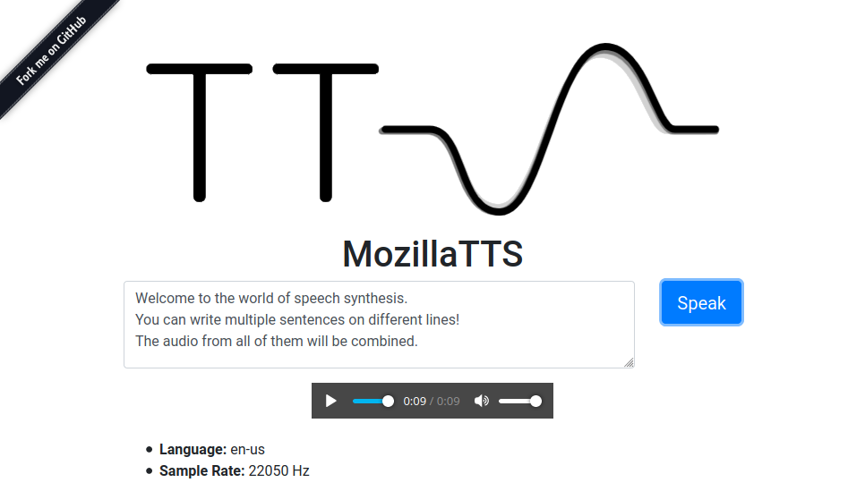

**NOTE**: Please see [coqui-docker](https://github.com/synesthesiam/coqui-docker/) for docker images of [Coqui TTS](https://github.com/coqui-ai/TTS) (Mozilla TTS's successor)

---

# Mozilla TTS

Multi-platform Docker images for [Mozilla TTS](https://github.com/mozilla/TTS). Many thanks to [erogol](https://github.com/erogol) and [the community](https://discourse.mozilla.org/c/tts/285)!



Supported languages (see [Released Models](https://github.com/mozilla/TTS/wiki/Released-Models)):

* U.S. English (`en`)
    * [Tacotron2 DDC model trained from LJSpeech](https://drive.google.com/drive/folders/1Y_0PcB7W6apQChXtbt6v3fAiNwVf4ER5?usp=sharing)
    * [Multi-band MelGAN vocoder trained from LJSpeech](https://drive.google.com/drive/folders/1XeRT0q4zm5gjERJqwmX5w84pMrD00cKD?usp=sharing)
* Spanish (`es`)
    * [Tacotron2 DDC model trained from M-AILabs](https://drive.google.com/drive/folders/1HxFUHQl6REh8CifOXL8IMlIyR9SDVcdu?usp=sharing)
    * [Full-band MelGAN vocoder trained from LibriTTS](https://drive.google.com/drive/folders/1LKAKOWqtUpiWr2Go3j5DFEFpUoQbW24C?usp=sharing)
    * [Notebook](https://colab.research.google.com/drive/1u_16ZzHjKYFn1HNVuA4Qf_i2MMFB9olY?usp=sharing)
* French (`fr`)
    * [Tacotron2 DDC model trained from M-AILabs](https://colab.research.google.com/drive/16T5avz3zOUNcIbF_dwfxnkZDENowx-tZ?usp=sharing)
    * [Full-band MelGAN vocoder trained from LibriTTS](https://drive.google.com/drive/folders/1LKAKOWqtUpiWr2Go3j5DFEFpUoQbW24C?usp=sharing)
    * [Notebook](https://colab.research.google.com/drive/16T5avz3zOUNcIbF_dwfxnkZDENowx-tZ?usp=sharing)
* German (`de`)
    * [Tacotron2 DDC model](https://colab.research.google.com/drive/1SPl226SwzrfMZltrVagIXya_ax4CsMh-?usp=sharing) trained from [Thorsten dataset](https://github.com/thorstenMueller/deep-learning-german-tts/)
    * [Parallel WaveGAN model](https://colab.research.google.com/drive/1SPl226SwzrfMZltrVagIXya_ax4CsMh-?usp=sharing) trained from same dataset
    * **Note:** due to a mistake at training configuration, this model does not read numbers written in digit form.

Supported platforms:

* `x86_64`
    * GPU is not supported (no CUDA or GPU-enabled PyTorch)
    * Your CPU **must** support AVX instructions (no Celeron, etc.)
* `armv7`
    * Raspberry Pi 2/3/4 (32-bit)
* `arm64`
    * Raspberry Pi 2/3/4 (64-bit)
    
### RAM Limitations

If you're running on a Raspberry Pi with only 1 GB of RAM, you may be unable to load some of the larger models without increasing your swap space. To do this, simply edit the `/etc/dphys-swapfile` file (with `sudo`) and increase `CONF_SWAPSIZE` (1000 is recommended, value is MB). Make sure to reboot after editing this file.

## Using

```sh
$ docker run -it -p 5002:5002 synesthesiam/mozillatts:<LANGUAGE>
```

where `<LANGUAGE>` is one of the supported languages (`en`, `es`, `fr`, `de`). If no language is given, U.S. English is used.

Visit http://localhost:5002 for web interface.

Do an HTTP GET at http://localhost:5002/api/tts?text=your%20sentence to get WAV audio back:

```sh
$ curl -G --output - \
    --data-urlencode 'text=Welcome to the world of speech synthesis!' \
    'http://localhost:5002/api/tts' | \
    aplay
```

HTTP POST is also supported:

```sh
$ curl -X POST -H 'Content-Type: text/plain' --output - \
    --data 'Welcome to the world of speech synthesis!' \
    'http://localhost:5002/api/tts' | \
    aplay
```

A `/process` endpoint is available for compatibility with [MaryTTS](http://mary.dfki.de/). Expose the correct port (59125) for maximum compatibility:

```sh
$ docker run -it -p 59125:5002 synesthesiam/mozillatts
```

You should now be able to use software like the [Home Assistant MaryTTS integration](https://www.home-assistant.io/integrations/marytts/).
Note that only the `INPUT_TEXT` field is actually used.

## Custom Model

The Docker image is usually built with [buildx](https://docs.docker.com/buildx/working-with-buildx/) for multi-platform support. If you just want to build an image for one platform, you can do this:

```sh
$ NOBUILDX=1 LANGUAGE=en scripts/build-docker.sh
```

When you set a `LANGUAGE`, the build script looks in `model/<LANGUAGE>`. These files should exist:

* `model/<LANGUAGE>/config.json`
* `model/<LANGUAGE>/checkpoint.pth.tar` (any name that ends in `.pth.tar` is fine)
* `model/<LANGUAGE>/scale_stats.npy` (optional)

Optionally, you may also include a vocoder:

* `model/<LANGUAGE>/vocoder/config.json`
* `model/<LANGUAGE>/vocoder/checkpoint.pth.tar` (any name that ends in `.pth.tar` is fine)
* `model/<LANGUAGE>/vocoder/scale_stats.npy` (optional)

If the sample rates between the model and vocoder don't match, the audio will be [interpolated](https://github.com/mozilla/TTS/issues/520).

### Docker Download Cache

When building the Docker image, the `download` directory may contain architecture-specific Python wheels. The `download/amd64` directory, for example, will be used with pip's `--find-links` on `x86_64` systems.

The `download/shared` directory is used for all architectures. If a `requirements.txt` file is present there, it is used to install dependencies for MozillaTTS. This can be used to exclude Tensorflow, etc., or to use specific package versions.

### Use Docker buildx

To use `buildx`, you'll need to [enable experimental features](https://docs.docker.com/buildx/working-with-buildx/) in the Docker CLI and then set up a private registry:

```sh
$ docker run -d -p 15555:5000 --name registry --restart=always registry:2
```

This registry runs on port 15555. Next, create a configuration file at `/etc/docker/buildx.conf` with this inside:

```
[registry."localhost:15555"]
  http = true
  insecure = true
```

Note the same port number (15555). Finally, run the following commands to create a builder:

```sh
$ docker run --rm --privileged multiarch/qemu-user-static --reset -p yes
$ docker buildx create --config /etc/docker/buildx.conf --use --name mybuilder
$ docker buildx use mybuilder
$ docker buildx inspect --bootstrap
```

For some reason, these have to be run again **after every reboot** and will sometimes require removing the builder first.

If all is well, you can build for specific platforms like this:

```sh
$ PLATFORMS=linux/arm/v7 LANGUAGE=en DOCKER_REGISTRY=localhost:15555 scripts/build-docker.sh
```

Note that the limiting factor for most platforms is a compiled PyTorch wheel. Pre-built wheels are available [here](https://github.com/synesthesiam/prebuilt-apps/releases) for ARM and PyTorch 1.6.0. Put wheels in the `download` directory before building.


